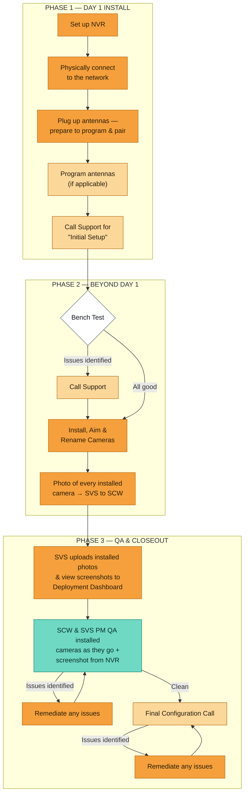

# SOP — Camera Install & Deployment (Day 1 → Closeout)

> **Confluence note:** paste this page as Markdown. The flowchart below is
> [Mermaid](https://mermaid.js.org/) — wrap it in the **Mermaid Diagrams for Confluence**
> macro (or Confluence Cloud's native `/mermaid` code-block renderer) to render it.
> If your space has no Mermaid macro, use the **Flowchart** section as a numbered
> procedure and attach the rendered PNG.

---

## 1. Purpose & scope

This SOP covers a camera system deployment from the moment the tech is on site with the
NVR through final system signoff. It defines who does what, in what order, what must be
true before each hand-off, and what the tech must have in the truck before they arrive.

**In scope:** NVR setup, network connection, antenna pairing, bench testing, camera
install/aim/rename, photo capture, QA, and the Final Configuration Call.

**Out of scope:** pre-site design, the customer questionnaire itself (an input here, not a
step), and any billing or change-order flow.

---

## 2. Roles

| Role | Who it is | Owns |
|---|---|---|
| **Tech** | On-site field technician (SVS) | NVR setup, network, antennas, bench test, physical install, aim, rename, install photos |
| **SCW Support** | SCW remote support desk | Initial Setup call, remote access, bench-test walkthrough, antenna programming, troubleshooting calls |
| **SVS PM** | Deploying partner's project manager | Uploads installed photos + view screenshots to the Deployment Dashboard; joint QA |
| **SCW PM** | SCW project manager | Joint QA against system design, NVR screenshots, Final Configuration Call |

---

## 3. Flowchart

---

## 4. Before you go — pre-arrival prep

Do not roll a truck until all of these are true.

- [ ] **Questionnaire is complete**, including whether IT has selected or required a static IP.
      *(Open item — see §8.1.)*
- [ ] **Network answer is known:** DHCP or static, and whether the NVR will be reachable from
      outside the client network for remote access.
- [ ] **Camera naming schema is confirmed** for this site (`E-001`, `I-002`, …).
- [ ] **Tech has a laptop.** If there is no cell service on site, the laptop is the only way in.
- [ ] **Tech has a monitor.** If there is no network at all, a monitor is mandatory — there is no
      remote path to the NVR.
- [ ] **All parties have reviewed the system design** and agree the site is ready.
- [ ] **Tech has SCW access / credentials** for the system (subject to what the client network allows).

---

## 5. Phase 1 — Day 1 Install

### 5.1 Set up NVR — *Tech*

1. Rack or place the NVR and power it up.
2. **Be prepared to iterate on WHERE the NVR is installed and what it's plugged into.** The
   planned location frequently loses to reality; expect to move it.
3. **Connect at least one camera to the NVR** before you call Support, so Support can walk you
   through bench testing if it becomes necessary.

### 5.2 Physically connect to the network — *Tech*

1. Patch the NVR to the client network per the questionnaire (DHCP or the assigned static IP).
2. Confirm the NVR pulls/holds an address before moving on.

### 5.3 Antennas — *Tech → SCW Support*

1. **Tech:** plug up antennas and prepare to program and pair.
2. **SCW Support:** program the antennas, if applicable to this site.

### 5.4 Call Support for "Initial Setup" — *SCW Support*

Support drives this call. Work the list top to bottom:

- [ ] **Remote access.** Confirm the NVR is reachable from the outside world. Check the
      questionnaire and confirm the addressing method (DHCP or static).
- [ ] **Bench testing procedures.** Review them with the tech if needed.
- [ ] **System access.** Confirm the tech has access to SCW and to the system — as far as the
      client network permits.
- [ ] **Camera naming.** Confirm the tech knows how to name cameras in the app, *and* that they
      know the schema they must follow (`E-001`, `I-002`, …).
- [ ] **Alerts.** Confirm the tech knows about alerts and that they **must turn alerts off during
      bench testing.**

**Exit criteria:** NVR is powered, addressed, reachable, at least one camera attached, antennas
programmed, alerts off, tech knows the naming schema.

---

## 6. Phase 2 — Beyond Day 1

### 6.1 Bench Test — *Tech* (decision point)

Bench test the system with alerts off.

- **All good →** proceed to install (§6.2).
- **Issues identified →** **Call Support.** Do not start hanging cameras on a system that failed
  bench test. Resolve with Support, then proceed to install.

### 6.2 Install, Aim & Rename Cameras — *Tech*

1. Install and physically aim each camera to the system design.
2. **Rename each camera to the agreed schema** (`E-001`, `I-002`, …) as you go — not at the end.

**Field contingencies:**

| Condition | What to do |
|---|---|
| No cell service | Use your laptop. |
| No network at all | You need the monitor you brought — there is no remote path. |
| Design doesn't match the site | Stop and get all parties on the design before continuing. |

### 6.3 Install photos — *Tech → SVS → SCW*

Take a photo of **every** installed camera and provide it to SVS, who provides it to SCW.
Photos are the evidence QA runs on; a missing photo is a missing camera as far as QA is concerned.

**Exit criteria:** every camera installed, aimed, renamed to schema, and photographed.

---

## 7. Phase 3 — QA & Closeout

### 7.1 Upload to the Deployment Dashboard — *SVS PM*

SVS uploads to the Deployment Dashboard:

- installed photos, and
- **view screenshots** (what the camera actually sees).

### 7.2 QA as you go — *SCW PM + SVS PM*

SCW and the SVS PM QA installed cameras **as they go** — not in one pass at the end — and pull a
screenshot from the NVR for each.

- **Issues identified →** remediate, then re-QA the affected cameras.
- **Clean →** schedule the Final Configuration Call.

### 7.3 Final Configuration Call — *SCW Support + Tech + PMs*

- [ ] **Test hard drives.**
- [ ] **Full system health check.**
- [ ] **Verify camera naming, IP addresses, and system questionnaire details are all correct.**

Anything found here goes back through remediation and returns to this call. The call is not
complete until all three checks pass.

**Exit criteria:** hard drives tested, health check clean, naming/IP/questionnaire verified —
system is handed over.

---

## 8. Open items

### 8.1 Static IP ownership — **unresolved**

> The **PM** needs to identify whether an IT-selected / IT-required IP is necessary. Today this is
> being sent to SVS. **Action:** make sure this is captured on the questionnaire so it arrives with
> the job instead of chasing it on install day.

**Owner:** PM · **Status:** open

### 8.2 To confirm

- Whether **antenna programming** is always Support-side or can be tech-side on some sites.
- The escalation path and target response time when a tech "Calls Support" mid-install.
- Whether "SVS uploads" (§7.1) is the SVS PM or the tech.

---

## 9. Change log

| Date | Change | By |
|---|---|---|
| 2026-08-25 | Initial SOP transcribed from the install-process whiteboard; remediation loops made explicit. | — |
