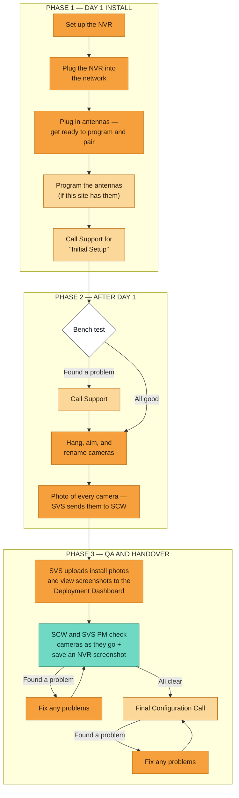

# SOP — Camera Install & Deployment (Day 1 to Handover)

> **Confluence note:** paste this page as Markdown. The flowchart below is written in
> [Mermaid](https://mermaid.js.org/). Wrap it in the **Mermaid Diagrams for Confluence**
> macro, or use Confluence Cloud's `/mermaid` code block, to make it draw. If your space
> has no Mermaid macro, use the steps below as the procedure and attach a picture of the chart.

---

## 1. What this covers

This guide covers a camera install. It starts when the tech gets to the site with the NVR.
It ends when the system is handed over. It tells you who does each step, in what order, and
what has to be done before you move on.

**This guide covers:** setting up the NVR, hooking it to the network, antennas, bench testing,
hanging and aiming cameras, renaming them, taking photos, QA, and the Final Configuration Call.

**This guide does not cover:** the system design, the customer questionnaire (that comes in as
an input, not a step), or billing and change orders.

---

## 2. Who does what

| Role | Who it is | What they do |
|---|---|---|
| **Tech** | The installer on site (SVS) | Sets up the NVR, hooks up the network, plugs in antennas, bench tests, hangs and aims cameras, renames them, takes photos |
| **SCW Support** | The SCW help desk | Runs the Initial Setup call, checks remote access, walks the tech through bench testing, programs antennas, takes help calls, runs the Final Configuration Call |
| **SVS PM** | The partner's project manager | Uploads install photos and view screenshots to the Deployment Dashboard, helps with QA |
| **SCW PM** | The SCW project manager | Checks cameras against the design, saves NVR screenshots, checks the work at handover |

---

## 3. Flowchart

The fix-it steps loop back. If QA or the Final Configuration Call finds a problem, the work goes
back to the same check after the fix. Nothing moves forward with a known problem.

---

## 4. Before you go

Do not leave for the site until every line below is true. Each one has cost us a trip back.

- [ ] **The questionnaire is filled out.** That includes whether IT picked an IP address we have
      to use. *(This one is still open — see §8.)*
- [ ] **You know the network answer.** DHCP or a static IP. You also know if the NVR has to be
      reachable from outside the client's network.
- [ ] **You know the camera naming rule for this site.** For example: `E-001`, `I-002`.
- [ ] **The tech has a laptop.** If there is no cell service, the laptop is the only way in.
- [ ] **The tech has a monitor.** If there is no network at all, you need one. There is no other
      way to reach the NVR.
- [ ] **Everyone has looked at the system design** and agrees the site is ready.
- [ ] **The tech can log in to SCW and the system**, as far as the client's network allows.

---

## 5. Phase 1 — Day 1 install

### 5.1 Set up the NVR — *Tech*

1. Put the NVR where it goes and power it on.
2. **Be ready to move it.** The spot in the plan often does not work once you see the site. You
   may have to try a different place, or plug it into something else. Expect this.
3. **Hook up at least one camera before you call Support.** Then Support can walk you through a
   bench test if you need one.

### 5.2 Plug the NVR into the network — *Tech*

1. Plug the NVR into the client's network. Use DHCP or the static IP from the questionnaire.
2. Make sure the NVR gets an address and keeps it before you move on.

### 5.3 Antennas — *Tech, then SCW Support*

1. **Tech:** plug in the antennas. Get them ready to program and pair.
2. **SCW Support:** program the antennas if this site has them.

### 5.4 Call Support for "Initial Setup" — *SCW Support*

Support runs this call. Go down the list in order.

- [ ] **Remote access.** Make sure you can reach the NVR from outside the client's network. Check
      the questionnaire for DHCP or a static IP.
- [ ] **Bench test steps.** Go over them with the tech if the tech needs it.
- [ ] **System access.** Make sure the tech can get into SCW and the system. The client's network
      may limit this.
- [ ] **Camera names.** Make sure the tech knows how to rename cameras in the app. Also make sure
      the tech knows the naming rule for this site (`E-001`, `I-002`).
- [ ] **Alerts.** Make sure the tech knows about alerts. The tech **has to turn alerts off during
      the bench test.**

**Done when:** the NVR is on, has an address, and can be reached. At least one camera is hooked
up. Antennas are programmed. Alerts are off. The tech knows the naming rule.

---

## 6. Phase 2 — After day 1

### 6.1 Bench test — *Tech* (this is a decision point)

Bench test the system with alerts turned off.

- **All good →** go hang cameras (§6.2).
- **Found a problem →** **call Support.** Do not hang cameras on a system that failed the bench
  test. Fix it with Support first. Then install.

### 6.2 Hang, aim, and rename cameras — *Tech*

1. Hang and aim each camera the way the system design shows.
2. **Rename each camera as you go.** Do not wait until the end of the day.

**If something goes wrong on site:**

| What's happening | What to do |
|---|---|
| No cell service | Use your laptop. |
| No network at all | Use the monitor you brought. There is no other way to reach the NVR. |
| The design does not match the site | Stop. Get everyone back on the design before you keep going. |

### 6.3 Photos — *Tech, then SVS, then SCW*

Take a photo of **every** camera you install. Send the photos to SVS. SVS sends them to SCW.
QA works from these photos. If a camera has no photo, QA treats it as not installed.

**Done when:** every camera is hung, aimed, renamed, and photographed.

---

## 7. Phase 3 — QA and handover

### 7.1 Upload to the Deployment Dashboard — *SVS PM*

SVS uploads two things:

- the install photos, and
- the **view screenshots** — what each camera actually sees.

### 7.2 Check cameras as you go — *SCW PM and SVS PM*

SCW and the SVS PM check installed cameras **as they go**. Do not wait and check them all at the
end. Save a screenshot from the NVR for each camera.

- **Found a problem →** fix it, then check that camera again.
- **All clear →** set up the Final Configuration Call.

### 7.3 Final Configuration Call — *SCW Support, the tech, and the PMs*

- [ ] **Test the hard drives.**
- [ ] **Do a full system health check.**
- [ ] **Check that camera names, IP addresses, and questionnaire details are all right.**

Anything you find on this call goes back for a fix. Then it comes back here. The call is not done
until all three checks pass.

**Done when:** hard drives are tested, the health check is clean, and names, IPs, and the
questionnaire have all been checked. The system is handed over.

---

## 8. Open questions

### 8.1 Who picks the IP address? — **still open**

> The **PM** has to find out if IT picked an IP address we have to use. Right now this goes to
> SVS. **What to do:** put this question on the questionnaire. Then the answer comes in with the
> job, instead of us chasing it on install day.

**Owner:** PM · **Status:** open

### 8.2 To confirm

- Does Support always program the antennas? Or can the tech do it at some sites?
- Who does the tech call for help during an install, and how fast should we answer?
- Who uploads to the Deployment Dashboard (§7.1) — the SVS PM or the tech?

---

## 9. Change log

| Date | Change | By |
|---|---|---|
| 2026-08-25 | First version. Written from the install whiteboard. Fix-it loops drawn in. Plain language pass. | — |
